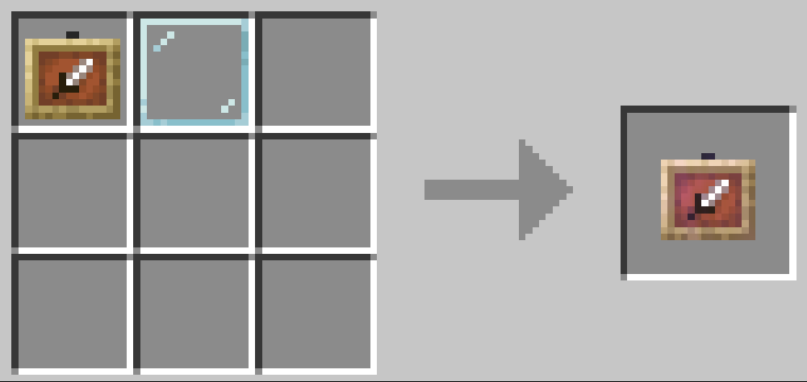
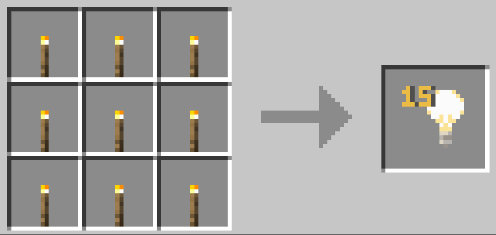
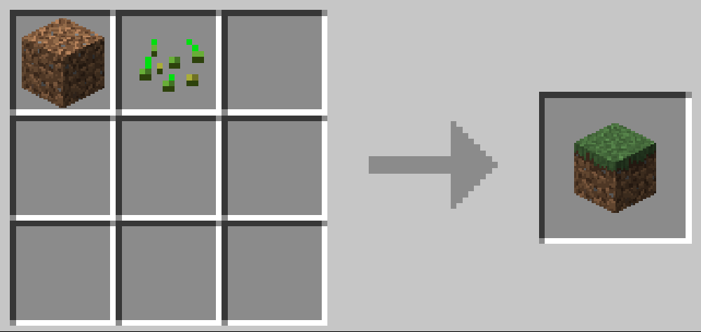
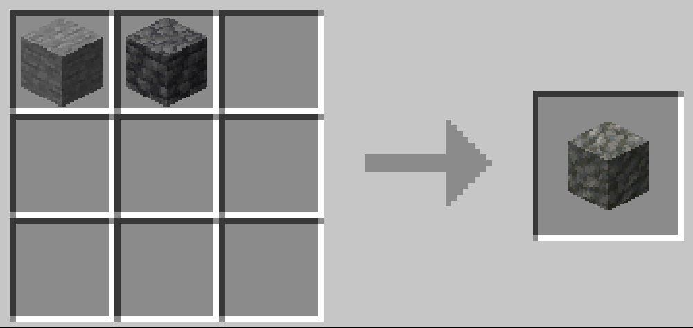
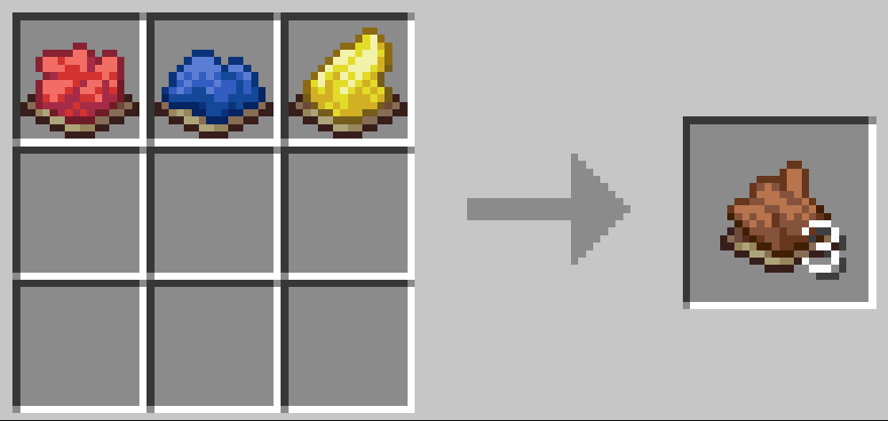
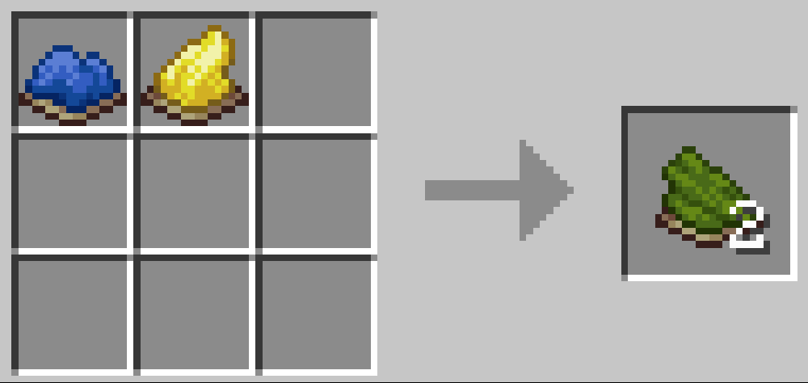

# Кастомные крафты

### Невидимые рамки

> Рамки, в которые если вставить предмет, то они становятся невидимыми

<figure><figcaption></figcaption></figure> <figure><figcaption></figcaption></figure>

### Блок света

> Невидимый блок, у которого уровень освещения 15

<figure><figcaption></figcaption></figure>

### Дёрн

> Земля + трава = земля с травой

<figure><figcaption></figcaption></figure>

### Туф

> Камень + чёрный камень = зеленоватый камень

<figure><figcaption></figcaption></figure>

### Красители

> Теперь не нужно искать ради них какао бобы/кактусы

<figure><figcaption></figcaption></figure> <figure><figcaption></figcaption></figure>

> Ура без геноцида спрутов

<figure><figcaption></figcaption></figure> <figure><figcaption></figcaption></figure>

