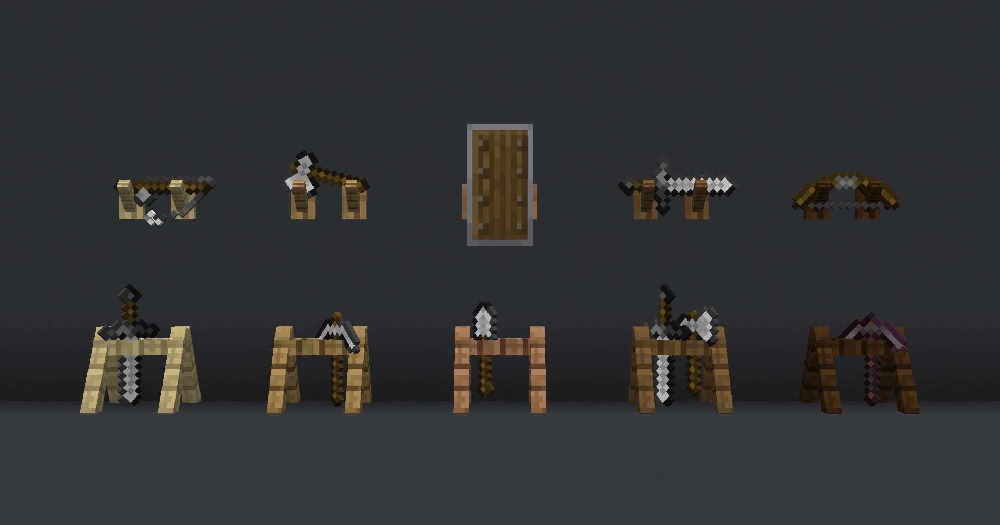

# Стойки для оружия

[\*ссылка на датапак\*](https://modrinth.com/datapack/racks)

<figure><figcaption></figcaption></figure>

### Как это сделать?

1. [Скрафтить стойку для оружия](stoiki-dlya-oruzhiya.md#kraft-stoiki)
2. Поставить её и правой кнопкой мыши повесить на неё что-то

### Крафт стойки

Работает с любым типом дерева

<figure><figcaption></figcaption></figure>

### Дополнительные фичи

Чтобы забрать предмет, просто кликните по стойке правой кнопкой мыши

Шифт + правая кнопка мыши поворачивает предмет в стойке

Стойки можно вешать в том числе на стену
